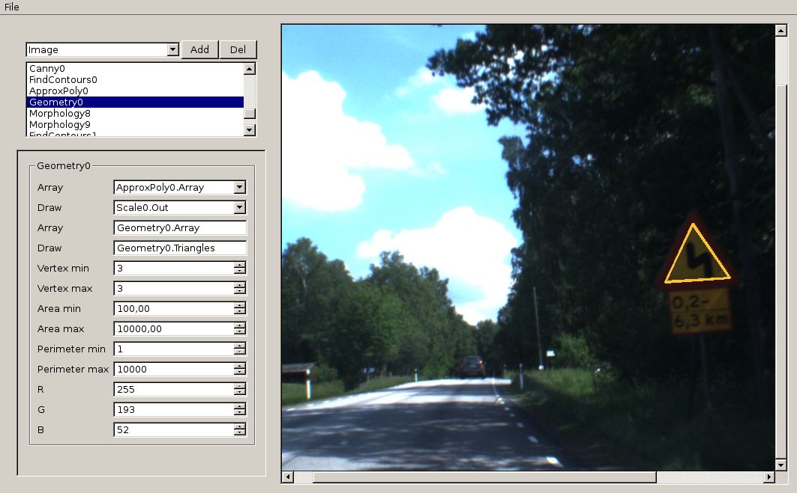

Nitrite.
=======

Introducción
------------
Nitrite es una herramienta de procesado digital de imágenes. Ha sido concebida 
para la resolución de una tarea en concreto, la de buscar y clasificar señales 
de tráfico. Sin embargo, debido a su diseño modular, se puede emplear para 
resolver otros problemas.

Módulos
-------
Un módulo proporciona una operación básica, por ejemplo aplicar un umbral, 
escalar una imagen o emplear la operación binaria AND entre dos imágenes 
binarias.

Cada módulo consta de entradas y salidas. Dependiendo del módulo variarán en 
número. Además cada entrada o salida lleva asociado un tipo o un conjunto de 
tipos de datos que pueden asociarse a esa conexión. Un ejemplo con la operación 
AND:

	.                    ____________
	Imagen binaria ---> |            |
	                    | Módulo AND | ---> Imagen binaria
	Imagen binaria ---> |            |
	                    '------------'

En la entrada no están permitidas imágenes a color, o en escala de grises, tan 
sólo imágenes binarias.

Además de poder configurar las conexiones de cada módulo, existen diferentes 
parámetros que se pueden ajustar en la configuración individual del módulo. Por 
ejemplo los valores de umbral, o el tipo de operación binaria.

Configuración
-------------
Empleando combinaciones de operaciones, es posible construir operaciones más 
complejas y especializadas en el problema a resolver. Esta estructura de módulos 
se puede almacenar en archivos de configuración json, para posteriormente 
recuperar la estructura creada. Además la configuración de cada módulo también 
es almacenada.

La configuración para detectar señales se puede encontrar en:

	config/sign/detect.json

Que se puede cargar desde el menú:

	File > Open config

Bibliotecas
-----------
Para el procesado de imágenes se emplea OpenCV en python2, así como algunas 
operaciones de scikit-image.

Ejecución
---------

	$ python2 nitrite.py

